# ncm 分析

## MP3

特意读了一下《音视频开发进阶指南》，总结如下：
我们平常说的mp3格式、wav格式的音乐其实是说的压缩编码格式。
一首歌是怎么从歌手的喉咙里发出后变成一个文件的呢？
需要经过采样、量化和编码三个步骤。

- 采样
  - 声音是连续的模拟信号，通过采样，将之转变为离散的数字信号，其中要遵循的是奈奎斯特定理：只要采样频率不低于声音信号最高频率的两倍，采样得到的数字信号就能保真地记录、还原声音。
  - 人耳能够听到的范围是20Hz到20kHz，所以采样频率一般为44.1kHz，这样就可以保证采样声音达到20kHz也能被数字化，从而使得经过数字化处理之后，人耳听到的声音质量不会被降低。而所谓的44.1kHz就是代表1秒会采样44100次
- 量化
  - 量化是指在幅度轴上对信号进行数字化，就是用多少位的数据来记录一个采样。比如用16比特的二进制信号来表示声音的一个采样，而16比特（一个short）所表示的范围是[-32768,32767]，共有65536个可能取值，因此最终模拟的音频信号在幅度上也分为了65536层
- 编码
  - 编码就是我们按一定的格式对采样和量化后的数字数据进行记录。直接存储的话，文件可能过大，像CD那样直接存储下来的没什么问题，但如果要在网络中在线传播，就必须进行压缩。
  - 压缩的原理是压缩掉冗余信号，包括人耳感知不到的信号以及人耳掩蔽效应（指人耳只对最明显的声音反应敏感）掩蔽掉的信号。同时压缩算法包括有损压缩和无损压缩。无损压缩是指解压后的数据可以完全复原。有损压缩是指解压后的数据不能完全复原，会丢失一部分信息。

第一种可能是网易独立进行了压缩编码算法的研究，创造出来的新的格式。

第二种是在现有格式的基础上，增加了一些冗余信息，相当于将一首MP3格式的歌放入密码箱中，付费者可开启。

不管是哪种，都必须了解格式的构成。

我自知学艺不精，所以去万能的GitHub上寻求答案。  
果然有先驱者，貌似是anonymous5l提供了最初的ncmdump版本，然后再由其他几位大佬进行重构和功能完善

1. <u><a rel="noopener" href="https://github.com/anonymous5l/ncmdump">anonymous5l</a></u>（C++，MIT协议）  
   基于openssl库编写，所以速度非常快，而且又好。
2. <u><a rel="noopener" href="https://github.com/nondanee/ncmdump">nondanee</a></u>（python，MIT协议）  
   依赖pycryptodome库、mutagen库，比较完善了。
3. <u><a rel="noopener" href="https://github.com/lianglixin/ncmdump">lianglixin</a></u>（python，MIT协议）  
   fork的nondanee作者的源码，修改了依赖库依赖pycrypto库，会有一些安装和使用问题
4. <u><a rel="noopener" href="https://github.com/yoki123/ncmdump">yoki123</a></u>（go,MIT协议）  
   依据anonymous51的工作，使用go语言实现

## ncm 格式分析

首先，我从<u><a rel="noopener" href="https://github.com/yoki123/ncmdump">yoki123</a></u>那里找到了一张NCM结构图  
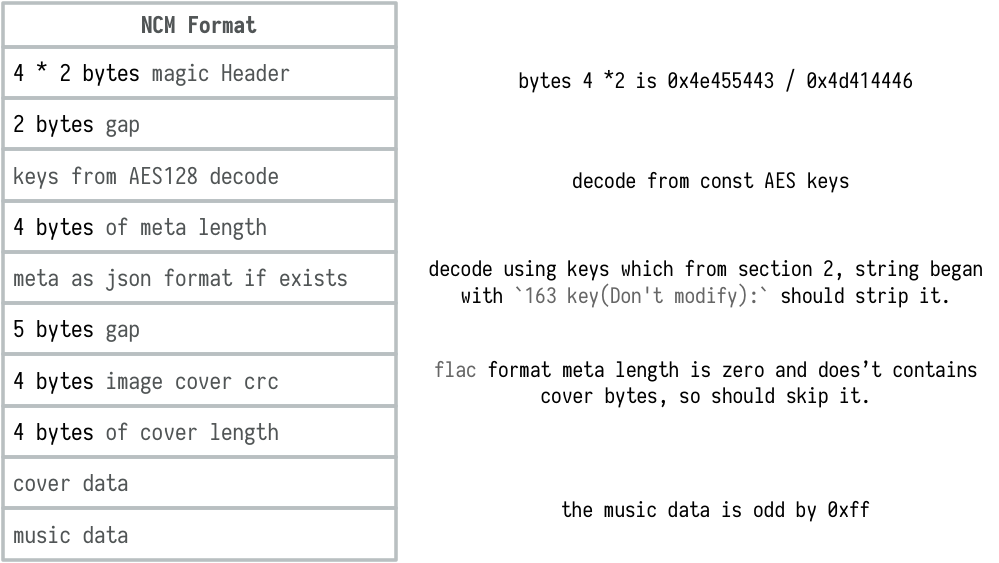  
由此可得知，NCM 实际上不是音频格式是容器格式，封装了对应格式的 Meta 以及封面等信息

## 密钥

另外，NCM使用了NCM使用了AES加密，但每个NCM加密的密钥是一样的，因此只要获取了AES的密钥KEY，就可以根据格式解开对应的资源。  
AES我知道，一种对称加密算法嘛，这学期刚好学了网络密码。  
AES是一种迭代型分组加密算法，分组长度为128bit，密钥长度为128、192或256bit，不同的密钥长度对应的迭代轮数不同，对应关系如下：

| 密钥长度 | 轮数  |
| ---- | --- |
| 128  | 10  |
| 192  | 12  |
| 256  | 14  |

我最好奇的是AES的密钥是怎么搞到的。出于“不可能只有我一个人好奇”的信念，看了好几个项目的README.md以及issues

结果只有一个人在yoki123的项目中issues了这个问题，

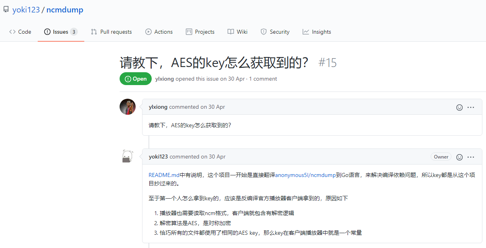  

大佬表示，他的密钥也是从annoymous51处获得的，但他推测是通过反编译播放器客户端得到的。

并给出了三条原因：

1. 播放器也需要读取ncm格式，客户端就包含有解密逻辑
2. 解密算法是AES，是对称加密
3. 恰巧所有的文件都使用了相同的AES key，那么key在客户端播放器中就是一个常量

而作为第一个搞到密钥的大佬annoymous51，他的项目中竟然没有一个人问这个问题，我自己问了一下，看大佬会不会回复  
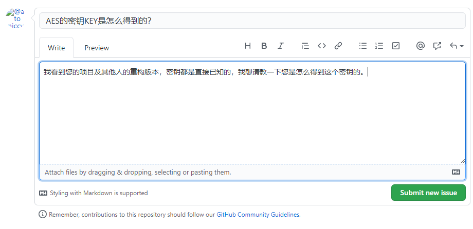  

## 代码分析

密钥的问题暂时不纠结了，接下来对照lianglixin的代码来钻研，  
<u><a rel="noopener" href="https://github.com/lianglixin/ncmdump">lianglixin</a></u>  
可以看到项目中有两个文件

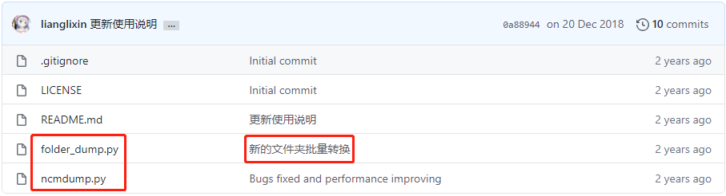  

从提交说明来看，folder_dump.py实现的是批量的转换，虽说Python文件操作的部分不难，但是有人做了这个工作也省得我自己动手了。  
在她的README.md中说明了需要安装依赖库pycrypto，使用`pip install pycrypto`安装，但如果使用了`Anaconda`，就不需要装了  
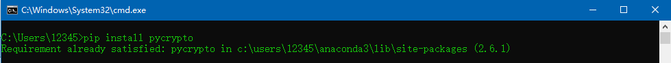    
代码地址为：<u><span>https://github.com/lianglixin/ncmdump/blob/master/folder_dump.py</span></u>  
相比于C++版本和Go语言版本，Python实现出来相对比较好懂，结构十分明朗，  
只有main函数和dump函数

##### main函数

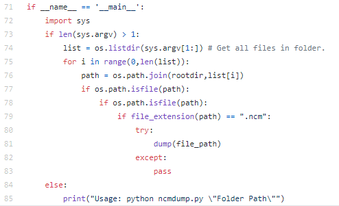   
main函数中用来进行文件操作，根据输入的参数中的文件夹，在此文件夹中的全部文件中进行筛选，找到.ncm格式的文件，执行dump函数  
这个程序按理来说，运行的方法是在命令行中cd到此文件所在路径，然后输入`python folder_dump.py ncm保存文件夹路径`  
但这种方式挺麻烦的，而且程序中竟然还有变量都没有定义，比如rootdir，因此无法运行成功，  
于是我对她这一部分再次进行了修改，我将main函数改成如下所示的内容：

```lua
if __name__ == '__main__':

    file_path = input("请输入文件所在路径(例如：E:\\ncm_music)\n")
    list = os.listdir(file_path) # Get all files in folder.
    for i in range(0,len(list)):
        # path = os.path.join("E:\\ncm_music",list[i])
        path = os.path.join(file_path, list[i])
        print(path)
        if os.path.isfile(path):
            if os.path.isfile(path):
                if file_extension(path) == ".ncm":
                    try:
                        dump(path)
                    except:
                        pass
```

效果如下：  
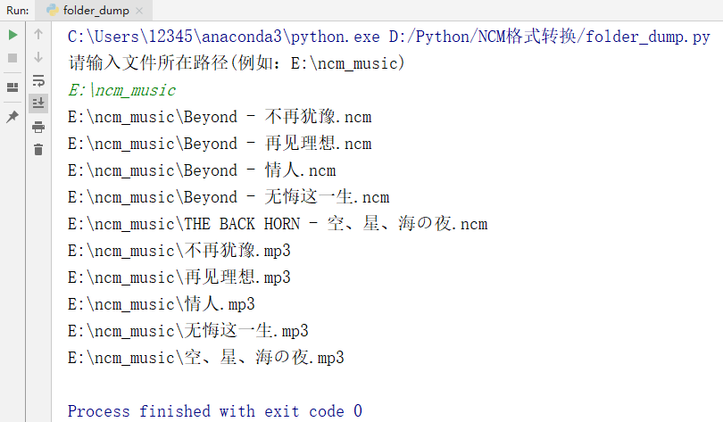   

### 导入模块

然后看看导入的模块

```haskell
import binascii
import struct
import base64
import json
import os
from Crypto.Cipher import AES
```

- binascii的主要作用是实现进制和字符串之间的转换。
- Python提供了struct模块，它是一个类似C或C++的struct结构，配合其模块提供的方法可以将二进制数据与Python的数据结构互相转换。
- Base64 是网络上最常见的用于传输 8Bit 字节码的编码方式之一，Base64 就是一种基于 64 
  个可打印字符来表示二进制数据的方法。可查看 RFC2045 ～ RFC2049，上面有 MIME 的详细规范。Base64 
  编码是从二进制到字符的过程，可用于在 HTTP 环境下传递较长的标识信息。比如使二进制数据可以作为电子邮件的内容正确地发送，用作 URL 
  的一部分，或者作为 HTTP POST 请求的一部分。
- json模块提供了对JSON的支持，它既包含了将JSON字符串恢复成Python对象的函数，也提供了将Python对象转换成JSON字符串的函数。
- os模块提供了多数操作系统的功能接口函数。当os模块被导入后，它会自适应于不同的操作系统平台，根据不同的平台进行相应的操作，在python编程时，经常和文件、目录打交道，所以离不开os模块。
- Crypto是一个加密算法模块，Cipher是该模块下的对称加密算法对象。


### dump 函数

最后看看dump函数，这个才是重点

```python
1. def dump(file_path):
2.     core_key = binascii.a2b_hex("687A4852416D736F356B496E62617857")
3.     meta_key = binascii.a2b_hex("2331346C6A6B5F215C5D2630553C2728")
4.     unpad = lambda s : s[0:-(s[-1] if type(s[-1]) == int else ord(s[-1]))]
5.     f = open(file_path,'rb')
6.     header = f.read(8)
7.     assert binascii.b2a_hex(header) == b'4354454e4644414d'
8.     f.seek(2, 1)
9.     key_length = f.read(4)
10.     key_length = struct.unpack('<I', bytes(key_length))[0]
11.     key_data = f.read(key_length)
12.     key_data_array = bytearray(key_data)
13.     for i in range (0,len(key_data_array)): key_data_array[i] ^= 0x64
14.     key_data = bytes(key_data_array)
15.     cryptor = AES.new(core_key, AES.MODE_ECB)
16.     key_data = unpad(cryptor.decrypt(key_data))[17:]
17.     key_length = len(key_data)
18.     key_data = bytearray(key_data)
19.     key_box = bytearray(range(256))
20.     c = 0
21.     last_byte = 0
22.     key_offset = 0
23.     for i in range(256):
24.         swap = key_box[i]
25.         c = (swap + last_byte + key_data[key_offset]) & 0xff
26.         key_offset += 1
27.         if key_offset >= key_length: key_offset = 0
28.         key_box[i] = key_box[c]
29.         key_box[c] = swap
30.         last_byte = c
31.     meta_length = f.read(4)
32.     meta_length = struct.unpack('<I', bytes(meta_length))[0]
33.     meta_data = f.read(meta_length)
34.     meta_data_array = bytearray(meta_data)
35.     for i in range(0,len(meta_data_array)): meta_data_array[i] ^= 0x63
36.     meta_data = bytes(meta_data_array)
37.     meta_data = base64.b64decode(meta_data[22:])
38.     cryptor = AES.new(meta_key, AES.MODE_ECB)
39.     meta_data = unpad(cryptor.decrypt(meta_data)).decode('utf-8')[6:]
40.     meta_data = json.loads(meta_data)
41.     crc32 = f.read(4)
42.     crc32 = struct.unpack('<I', bytes(crc32))[0]
43.     f.seek(5, 1)
44.     image_size = f.read(4)
45.     image_size = struct.unpack('<I', bytes(image_size))[0]
46.     image_data = f.read(image_size)
47.     file_name = meta_data['musicName'] + '.' + meta_data['format']
48.     m = open(os.path.join(os.path.split(file_path)[0],file_name),'wb')
49.     chunk = bytearray()
50.     while True:
51.         chunk = bytearray(f.read(0x8000))
52.         chunk_length = len(chunk)
53.         if not chunk:
54.             break
55.         for i in range(1,chunk_length+1):
56.             j = i & 0xff;
57.             chunk[i-1] ^= key_box[(key_box[j] + key_box[(key_box[j] + j) & 0xff]) & 0xff]
58.         m.write(chunk)
59.     m.close()
60.     f.close()
61. def file_extension(path):
62.     return os.path.splitext(path)[1]
```

---

第2行，`core_key = binascii.a2b_hex("687A4852416D736F356B496E62617857")`  
第3行，`meta_key = binascii.a2b_hex("2331346C6A6B5F215C5D2630553C2728")`  
第2行和第3行用到的binascii.a2b_hex函数，作用是将16进制数据转为字符串，同时必须是偶数个十六进制数字，否则会报错  
所以`core_key`等于`b'hzHRAmso5kInbaxW'`，`meta_key`等于`b"#14ljk_!\\]&0U<'("`  
第7行用到的binascii.b2a_hex函数与之相反，是将字符串转成16进制  
你可能会好奇这个b'4354454e4644414d'是什么意思，  
在Python3.x中，字符串前面加个b表示后面的字符串是bytes类型。类似的还有字符串前面加个r，用来取消后面字符串中反斜杠的转义含义，比如r"\n\n",表示我就想输出\n\n这个字符串，不要把它理解为换行符。还有前面加个u的，用来表示后面的字符串以Unicode编码，防止出现因中文字符导致的乱码问题。  
而这个`4354454e4644414d`是什么呢？对照一下前面我贴出来的NCM结构图，这个就是8字节的magic header。可以用二进制编辑器打开ncm文件，比如UltraEdit，如果你只需要验证这个magic的话，普通编辑器如记事本也可以。  
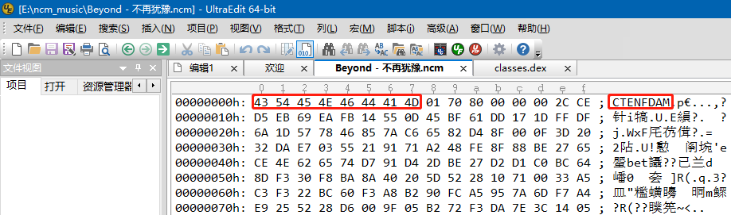  
换了几首歌，这个值都一样，都是`CTENFDAM`

---

然后看第4行，  
`unpad = lambda s : s[0:-(s[-1] if type(s[-1]) == int else ord(s[-1]))]`  
Python中定义函数有两种方法，一种是用def定义，就如这个dump函数的定义一样，这是比较常规的做法。第二种是用lambda定义，称为lambda函数（或匿名函数）。  
lambda的格式如下：  
lambd 参数:表达式  
举一个简单的例子：

```csharp
add = lambda x, y : x + y
sum_ = add(2, 3)
print(sum_)
输出为5
```

也就是通过lambda可以定义一个函数，然后冒号前面是函数的参数，冒号后面是执行的表达式，其值作为输出返回，然后它将创建的函数对象分配给一个变量，那么这个变量就是具有这个功能的函数了。  
如果用熟悉的方式来看，这个相当于

```python
def unpad(s):
      return s[0:-(s[-1] if type(s[-1]) == int else ord(s[-1]))]
```

其中ord函数的作用是将一个字符，转换成ASCII码对应十进制的值，比如ord('a')的结果是97

---

再来看第5行、第6行以及第8行，  
第5行，`f = open(file_path,'rb')`  
第6行，`header = f.read(8)`  
第8行，`f.seek(2, 1)`  
把这几行放到一起，是因为它们都与文件操作的知识有关。  
`open(file_path,'rb')`  
file_path是读取的文件名，'rb'是读取文件的一种模式  
进行读文件操作时，如果没有其他条件，直到读到文档结束符（EOF）才算读取到文件最后，Python会认为字节\x1A(26)转换成的字符为文档结束符（EOF）  
那么如果如果二进制文件中存在1A会怎样呢？  
如果使用'r'进行读取，则读到字节为1A时，就认为文件结束，此时可能造成文件读取不完全的问题。  
如果使用'rb'按照二进制位进行读取的，不会将读取的字节转换成字符，从而避免了上面的错误。  
`f.read(8)`  
read中可以没有参数，f.read()则会一直读取到文件结束，如果有参数，f.read(size)表示读取size个字节的数据。  
`f.seek(2, 1)`  
在文件操作中，有个指针指向当前读写的位置，刚打开一个文件时，这个指针指向文件的开始位置，并且会随着读写操作的进行而移动，使用f.close()关闭文件后，再次打开，该指针会重新指向开始位置。  
但在关闭之前，如果想要改变该指针的位置，就要用到seek函数，格式如下：  
`seek(offset,whence)`  
offset是偏移值，也就是需要将该指针移动多少个字节，为正时表示向后移动，为负时表示向前移动。  
whence是对offset的定义，要移动指针，总得知道从哪开始移动吧。当whence为0时，表示从文件起始处开始，whence为1时表示从当前位置开始，whence为2时表示从文件末尾开始。  
所以这个f.seek(2,1)的含义就是将指针从当前位置处，向后移动两个字节。  
结合NCM的结构图来看，对应的是2 bytes gap，  
我不禁开始猜测这两个字节的含义，比如是不是这个文件的校验值之类的  
但我发现正如每前8个字节都是`4354454e4644414d`一样，第9个和第10个字节每个ncm文件中也都是0170。  
于是我稍稍更改了一下代码，进行试验  
原版：

```lua
header = f.read(8)
assert binascii.b2a_hex(header) == b'4354454e4644414d'
f.seek(2, 1)
```

更改后：

```lua
header = f.read(10)
assert binascii.b2a_hex(header) == b'4354454e4644414d0170'
# f.seek(2, 1)
```

重新运行之后，发现一样可以转换为MP3格式  
也就是说，其实这两个字节没什么特别之处，和前面八个字节一样，应该也属于magic才对，或许有别的什么原因，不过这两个字节无论是跳过还是和前八个字节一起读取识别，都是一样的效果。

---

第9行和第10行  
这两行的作用是获得密钥长度

```ini
key_length = f.read(4)
key_length = struct.unpack('<I', bytes(key_length))[0]
```

第9行是正常的读取4个字节的数据，  
根据结构图中的提示，这部分是记录的密钥的长度


第10行则是将第9行读取的二进制数据以小端字节序、无符号整型的格式来解析读取的数据。  
struct有三种常用方法：

- pack(fmt, v1, v2, ...)  
  按照指定格式（fmt）将数据(v1, v2, ...)封装为指定格式，就是把存储的对象转成二进制数据。
- unpack(fmt, string)  
  按照指定格式（fmt）将想要解析的数据（string）解析后以元组（tuple）对象返回，将二进制数据还原成Python对象。
- calcsize(fmt)  
  计算指定格式（fmt）占用多少字节。

我将`struct.unpack('<I', bytes(key_length))`的结果赋给了变量`key_length_struct`变量  
然后下个断点，检查一下运行过程中对应的值，结果如下：  
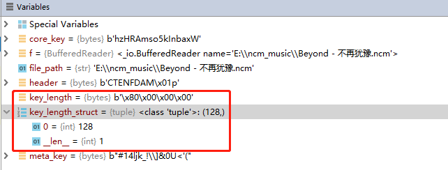  
再来对照unpack方法，就能理解了，  
通过`f.read(4)`获得4字节的数据为`b'\x80\x00\x00\x00'`  
然后通过`struct.unpack('<I', bytes(key_length))`十六进制数据按照小端字节序，无符号整型数据解析，对应的十六进制数据也就是0x00000080，对应的十进制数就是128，前面介绍过，AES有三种密钥长度128、192、256，此处用的正是最常用的128位的密钥长度。  
从上图中还可以看出，unpack方法返回的确实是一个元组对象，包含一个元素128，对应的元组为(128,)  
补充：  
struct函数中用到的格式

- 与整数数值有关的数据格式  
  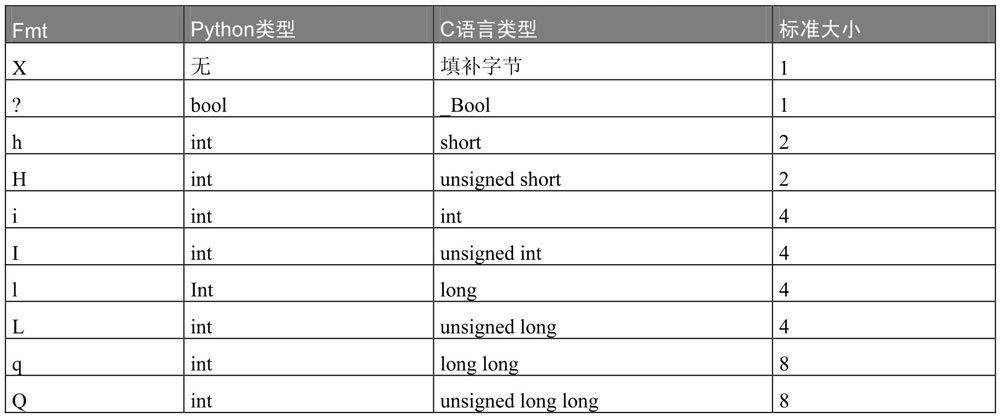
- 与字符、浮点数有关的数据格式  
  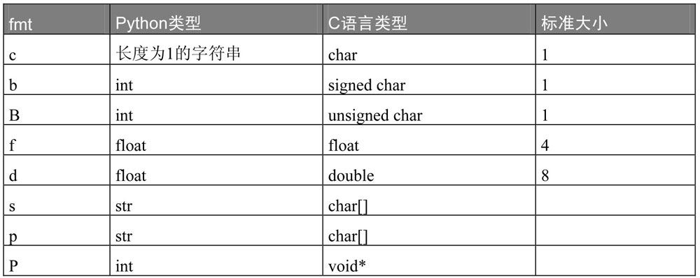
- 字节的顺序和大小  
  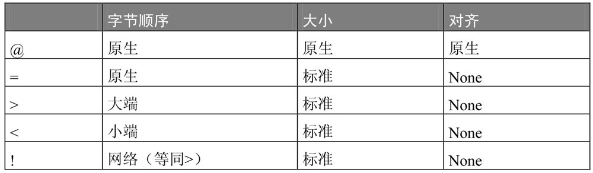

---

第11行到第18行

```makefile
key_data = f.read(key_length)
key_data_array = bytearray(key_data)
for i in range (0,len(key_data_array)): key_data_array[i] ^= 0x64
key_data = bytes(key_data_array)
cryptor = AES.new(core_key, AES.MODE_ECB)
key_data = unpad(cryptor.decrypt(key_data))[17:]
key_length = len(key_data)
key_data = bytearray(key_data)
```

写出这些代码的大佬，虽然厉害，但是变量名重用次数极多，而且也没有一点注释，可读性有点差，一定要分清哪个变量当前处于什么值。  
第11行，`key_data = f.read(key_length)`  
第11行处的`key_length`承接的是第10行的整数128，因此第11行的意思是向后读取128字节的内容，并赋给`key_data`  
此时的key_data为b',\xce\xd5\xebi\xea\xfb\x14U\rE\xbfa\xdd\x17\x1d\xff\xdfj\x1dWxF\x85z\xc6e\x82\xd4\x8f\x00\x0f=

2\xda\xe7\x03U!\x91q\xa2H\xfe\x8f\x88\xbe'e\xceNbet\xd7\x91\xd4-\xbe'\xd2\xd1\xc0\xbcd\x8d\xf30\xf8\xba\x8a@

]R(\x10q\x003\xa5\xc3\xf3"\xbc`\xf3\xa8\xb2\x90\xfc\xa5\x95zm\xf7\xa4\xe9%R(\xd6\x00\x9f\x05\xb2r\xf3\xda~<\x14\x05\xa4\xc6\xa6\xf4X\x0f_\x84\xc5\xaf\xfc\xd7M\x1e'

第12行，`key_data_array = bytearray(key_data)`  
通过bytearray将128字节的数据转换成字节数组。  
bytearray与bytes的区别在于它是可变的，可以通过元素赋值进行修改，方法是将对应的字节处赋一个范围为0-255的整数，比如下面这个例子：

```python-repl
>>> x = bytearray(b"Hello!")
>>> x[1] = ord(b"u")
>>> x
bytearray(b'Hullo!')
```

要将第一个字节处的字符“e”替换成“u”，首先得借助ord函数将“u”转换成整数再赋给x[1]  
第13行，`for i in range (0,len(key_data_array)): key_data_array[i] ^= 0x64`  
将字节数组`key_data_array`的每个字节中的值与0x64进行异或操作  
这一步挺让人费解的，这个0x64像是从天而降一般毫无征兆。  
但我估计这是一种混淆策略(推测而已），0x64可能只是加密的人随意构造的一个数，用来进一步加强解密的难度，只不过不知道这个项目的创始人`anonymous5l`是怎么发现的。  
第14行，`key_data = bytes(key_data_array)`  
这128字节的内容逐字节与0x64异或完之后，再次用bytes函数将其转为不可更改的字节序列。  
第15行，`cryptor = AES.new(core_key, AES.MODE_ECB)`  
AES.new()函数创建一个AES实例，通常是三个参数，分别为密钥key，模式mode以及初始向量iv  
由于此处是电码本模式(ECB)，所以不需要初始向量iv  
补充：  
分组加密有四种工作模式

- 电码本ECB(electronic codebook mode)
- 密码分组链接CBC(cipher block chaining)
- 密文反馈CFB(cipher feedback)
- 输出反馈OFB(output feedback)

第16行，`key_data = unpad(cryptor.decrypt(key_data))[17:]`  
第16行可以分成三步来看。

1. 第一步是`cryptor.decrypt(key_data)`得到明文，`cryptor`是上一行代码中创建的AES实例，包含了密钥和解密模式，`decrypt`是`Crypto.Cipher.AES`库中的解密函数，`key_data`是待解密的密文。
2. 第二步是用第4行用匿名函数lambda定义的函数unpad，结合起来看就是将`cryptor.decrypt(key_data)`得到的明文中的第1位到第-s[-1]位的数据提取出来，s[-1]是最后一位的值，这个第-s[-1]位是指倒数第s[-1]位。  
   以“不再犹豫”这首歌为例，通过`cryptor.decrypt(key_data)`得到的明文为  
   b'neteasecloudmusic116782465020426E7fT49x7dof9OKCgg9cdvhEuezy3iZCL1nFvBFd1T4uSktAJKmwZXsijPbijliionVUXXg9plTbXEclAE9Lb\x0c\x0c\x0c\x0c\x0c\x0c\x0c\x0c\x0c\x0c\x0c'，  
   那么第-1位为十六进制的c，也就是12，  
   那么`unpad(cryptor.decrypt(key_data))`之后得到的结果为  
   b'neteasecloudmusic116782465020426E7fT49x7dof9OKCgg9cdvhEuezy3iZCL1nFvBFd1T4uSktAJKmwZXsijPbijliionVUXXg9plTbXEclAE9Lb'，  
   也就是从第一位到倒数第13位（不包括倒数第12位）  
   需要这一步的原因是分组加密的工作原理决定的，分组加密中给定加密消息的长度是随机的，因此，最后一个分组的消息不一定够一个标准的分组长度，此时需要进行填充，填充的原则如下：  
   如果数据的长度不是分组的整数倍，需要填充数据到分组的倍数，如果数据的长度是分组的倍数，需要填充分组长度的数据，填充的每个字节值为填充的长度。
3. 第三步是将第二步去掉填充后的结果去掉前面的neteasecloudmusic，并将这个最终的结果赋值给key_data

第17行，`key_length = len(key_data)`  
计算`key_data`的长度，我们自己都可以算出来了，128位-12位填充-17位“neteasecloudmusic”，那就是99位，也就是说此时`key_length`等于99  
第18行，`key_data = bytearray(key_data)`  
将bytes类型的key_data再次转为可变的bytearray类型

---

RC4（来自Rivest Cipher 4的缩写）是一种流加密算法，密钥长度可变。它加解密使用相同的密钥，一个字节一个字节地加密。因此也属于对称加密算法。突出优点是在软件里面很容易实现。  
包含两个处理过程：一是秘钥调度算法(KSA)，用于打乱S盒的初始排列，另外一个是伪随机数生成算法(PRGA)，用来输出随机序列并修改S的当前顺序。

1. 根据秘钥生成S盒
2. 利用PRGA生成秘钥流
3. 秘钥与明文异或产生密文

s盒的作用相当于一个函数，一个字节通过这个函数可以转换到另一个字节，这个过程称为字节代换  
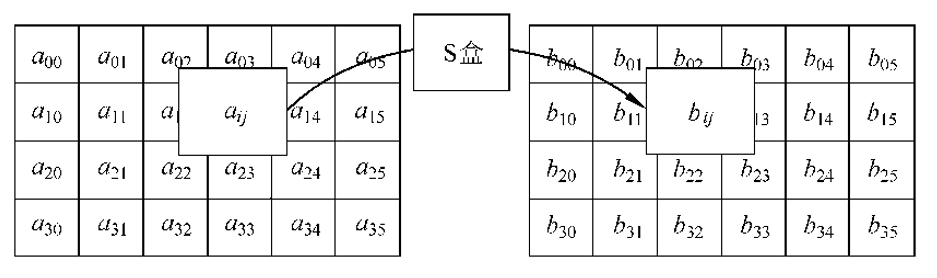

第19行到第30行，是标准的RC4-KSA算法生成S盒

```r
key_box = bytearray(range(256))
c = 0
last_byte = 0
key_offset = 0
for i in range(256):
    swap = key_box[i]
    c = (swap + last_byte + key_data[key_offset]) & 0xff
    key_offset += 1
    if key_offset >= key_length: key_offset = 0
    key_box[i] = key_box[c]
    key_box[c] = swap
    last_byte = c
```

第19行，`key_box = bytearray(range(256))`  
生成一个字节取值为0-255的字节数组，作为s盒的初值。  
`bytearray(b'\x00\x01\x02\x03\x04\x05\x06\x07\x08\t\n\x0b\x0c\r\x0e\x0f\x10\x11\x12\x13\x14\x15\x16\x17\x18\x19\x1a\x1b\x1c\x1d\x1e\x1f !"#$%&\'()*+,-./0123456789:;<=>?@ABCDEFGHIJKLMNOPQRSTUVWXYZ[\\]^_`abcdefghijklmnopqrstuvwxyz{|}~\x7f\x80\x81\x82\x83\x84\x85\x86\x87\x88\x89\x8a\x8b\x8c\x8d\x8e\x8f\x90\x91\x92\x93\x94\x95\x96\x97\x98\x99\x9a\x9b\x9c\x9d\x9e\x9f\xa0\xa1\xa2\xa3\xa4\xa5\xa6\xa7\xa8\xa9\xaa\xab\xac\xad\xae\xaf\xb0\xb1\xb2\xb3\xb4\xb5\xb6\xb7\xb8\xb9\xba\xbb\xbc\xbd\xbe\xbf\xc0\xc1\xc2\xc3\xc4\xc5\xc6\xc7\xc8\xc9\xca\xcb\xcc\xcd\xce\xcf\xd0\xd1\xd2\xd3\xd4\xd5\xd6\xd7\xd8\xd9\xda\xdb\xdc\xdd\xde\xdf\xe0\xe1\xe2\xe3\xe4\xe5\xe6\xe7\xe8\xe9\xea\xeb\xec\xed\xee\xef\xf0\xf1\xf2\xf3\xf4\xf5\xf6\xf7\xf8\xf9\xfa\xfb\xfc\xfd\xfe\xff')`

第20行到第22行，

```ini
c = 0
last_byte = 0
key_offset = 0
```

对三个变量赋初值，三个变量的含义可以在后面看出来  
第23行到第30行，

```r
for i in range(256):
    swap = key_box[i]
    c = (swap + last_byte + key_data[key_offset]) & 0xff
    key_offset += 1
    if key_offset >= key_length: key_offset = 0
    key_box[i] = key_box[c]
    key_box[c] = swap
    last_byte = c
```

这个for循环用来生成s盒，i是用来保证s盒中的每个元素都得到处理。c保证s盒的搅乱是随机的。last_byte是上一轮的c。key_offset是偏移值，每轮加1。swap用于key_box[i]和key_box[j]的交换，是一个中间值。`c = (swap + last_byte + key_data[key_offset]) & 0xff`，这个& 0xff，主要是用来防止c的值超出0-255的范围，起到了一个模256的作用。

---

第31行到第40行，

```makefile
meta_length = f.read(4)
meta_length = struct.unpack('<I', bytes(meta_length))[0]
meta_data = f.read(meta_length)
meta_data_array = bytearray(meta_data)
for i in range(0,len(meta_data_array)): meta_data_array[i] ^= 0x63
meta_data = bytes(meta_data_array)
meta_data = base64.b64decode(meta_data[22:])
cryptor = AES.new(meta_key, AES.MODE_ECB)
meta_data = unpad(cryptor.decrypt(meta_data)).decode('utf-8')[6:]
meta_data = json.loads(meta_data)
```

不少东西都和前面相同，不懂的地方看看前面的分析。简要说一说大致的流程。  
首先读取4字节的内容，然后以小端字节序、无符号整型的格式解析这个字节序列，得到长度为514  
然后再向后读取514字节，得到的字节序列转为字节数组。再将这个字节数组逐字节异或0x63。  
异或操作完成之后，再转为不可变的bytes类型的字节序列，此时得到的meta_data的值为：b"163 key(Don't 
modify):L64FU3W4YxX3ZFTmbZ+8/YZCV9ufCcdlM1ujbONJR87i4NNPDeH1CSepQa8pfIqD6YVjsvwuQ/0tZRYHJ1WPIzm9r25BGMoAzMdfkiEjlif8VGkcV9qxjuDCrfs4kyw3Qk0MO38TqO13dP1QFqwyGBg136s014agaLb9aILz/o5prV1bJzeMAPIcLaztgyAHUYOoG71Vntk8qjah8nRwtvu9RK3E+q0xbYQZo4MLizOFaRlU0qT0hskVCmbJqb8rwXymivivZlZtw+HRd+OlevtsE4alT+R591CFU3rZ3WNaofo+jD5KYCGNEjMW1EGCoa2RPFaCgbY5dR3Czw3XPnZAFnyCywhp8QkvM+AU3FLRCJxIaTMcRRWpQcGzi/MlFJ5MhX5fSF/ahlk370d5nd3AMqRuII8TSN7rEzZ/wa/vLE45eMglcQ4Kp0YFlDpscxh/q1K3chuIVviUu1QG3spTcmRaiz/b6YnyZDz7S5k="  
前面这一串莫名的眼熟，原来是格式表中当初感到莫名其妙的东西  
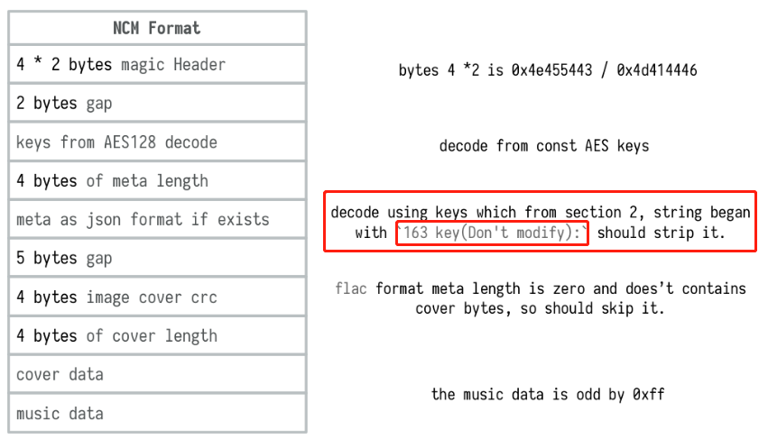  
去掉前22个字节`163 key(Don't modify):`后，以base64的方式解码，得到的又是AES算法的密文，同样还是以ECB电码本模式解密的。  
顺便一提，电码本模式不愧为最简单的加密模式，相同的明文对应相同的密文，我觉得直接根据密文都可以将这段数据的结构分析出来。  
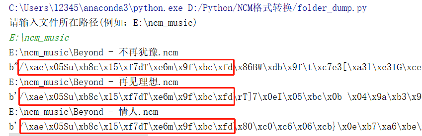  
然后解密之后，以“不再犹豫”这首歌为例，`unpad(cryptor.decrypt(meta_data)).decode('utf-8')`得到的结果为music:{"musicId":347597,"musicName":"不再犹豫","artist":[["Beyond",11127]],"albumId":34250,"album":"犹豫","albumPicDocId":54975581392009,"albumPic":"[https://p4.music.126.net/jFVtPnc0-cBv4k2_Fuld-A==/54975581392009.jpg","bitrate":192000,"mp3DocId":"dcc2aa566779833f1630c34e603a41b4","duration":255896,"mvId":5501499,"alias":[],"transNames":[],"format":"mp3](https://p4.music.126.net/jFVtPnc0-cBv4k2_Fuld-A==/54975581392009.jpg%22,%22bitrate%22:192000,%22mp3DocId%22:%22dcc2aa566779833f1630c34e603a41b4%22,%22duration%22:255896,%22mvId%22:5501499,%22alias%22:%5B%5D,%22transNames%22:%5B%5D,%22format%22:%22mp3)"}  
有点牛逼，把“music:”去掉不就是一个json格式嘛，所以后面加了一个[6:]  
而且最后的`"format":"mp3"`，感觉有种卖萌的意思，这就是爷下的无损音乐？  
中间还有个url，点开一看原来是封面图片，写个简单的爬虫就可以下载到本地了，但是对我来说没啥用，就没搞了。

---

第41行到第43行

```lua
crc32 = f.read(4)
crc32 = struct.unpack('<I', bytes(crc32))[0]
f.seek(5, 1)
```

这个是读取4字节的数据，然后转为十进制整数，得到CRC校验码  
然后跳过5字节的数据，这5字节的内容好像确实没啥用，我尝试读取了一下，得到的结果每次还不同，我人都看傻了。反正不用管这5字节，直接seek函数跳过即可。

---

第44行到第46行

```ini
image_size = f.read(4)
image_size = struct.unpack('<I', bytes(image_size))[0]
image_data = f.read(image_size)
```

得到封面的数据信息

---

第47行到第60行

```lua
file_name = meta_data['musicName'] + '.' + meta_data['format']
m = open(os.path.join(os.path.split(file_path)[0],file_name),'wb')
chunk = bytearray()
while True:
    chunk = bytearray(f.read(0x8000))
    chunk_length = len(chunk)
    if not chunk:
        break
    for i in range(1,chunk_length+1):
        j = i & 0xff;
        chunk[i-1] ^= key_box[(key_box[j] + key_box[(key_box[j] + j) & 0xff]) & 0xff]
    m.write(chunk)
m.close()
f.close()
```

第47行，`file_name = meta_data['musicName'] + '.' + meta_data['format']`  
结合第40行通过json.loads得到的字典类型的meta_data，可以根据对应的键获得对应的值，从而得到想要的命名合理的音乐文件名。  
第48行，`m = open(os.path.join(os.path.split(file_path)[0],file_name),'wb')`  
创建了一个文件对象m，第一个参数是文件所在的路径，该路径由两部分组成，第一部分是输入的ncm文件所在的文件夹的路径，由用户输入；第二部分是生成的对应的mp3文件的名称，  
比如输入`E:\ncm_music`，然后得到的文件是`E:\ncm_music\不再犹豫.mp3`  
wb的含义是以二进制格式打开一个文件只用于写入。如果该文件已存在则打开文件，并从开头开始编辑，即原有内容会被删除。如果该文件不存在，创建新文件。一般用于非文本文件如图片等。  
其他模式可以参考：<u><a rel="noopener" href="https://www.runoob.com/python3/python3-file-methods.html">Python3 File 方法 | 菜鸟教程</a></u>  
第49行，`chunk = bytearray()`  
得到一个长度为0的字节数组chunk  
从第50行开始进入一个死循环，每次读取32768个字节的数据，并把得到的字节数组赋给chunk，直到chunk长度为0时跳出循环。  
然后while循环中有个for循环，这个循环是RC4算法的第二部分，伪随机序列产生算法（Pseudo Random Generation 
Algorithm，PRGA），每次从S盒选取一个元素输出，并置换S盒便于下一轮取出，取出来的伪随机序列就是RC4算法的密钥流。  
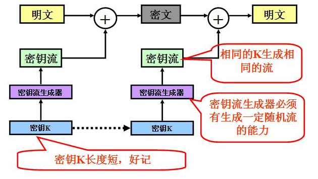  
最后依次关闭文件对象m和f，否则可能会导致文件出现错误。

### 代码完整版

```python
# -*- coding = utf-8 -*-
# @time:2020/8/3/003 23:26
# Author:cyx
# @File:folder_dump.py
# @Software:PyCharm

# Modifier: Liang Lixin
# Folder dump version by LiangLixin
import binascii
import struct
import base64
import json
import os
from Crypto.Cipher import AES

def dump(file_path):
    core_key = binascii.a2b_hex("687A4852416D736F356B496E62617857")
    meta_key = binascii.a2b_hex("2331346C6A6B5F215C5D2630553C2728")
    unpad = lambda s : s[0:-(s[-1] if type(s[-1]) == int else ord(s[-1]))]
    f = open(file_path,'rb')
    header = f.read(8)
    assert binascii.b2a_hex(header) == b'4354454e4644414d'
    f.seek(2, 1)
    key_length = f.read(4)
    key_length = struct.unpack('<I', bytes(key_length))[0]
    key_data = f.read(key_length)
    key_data_array = bytearray(key_data)
    for i in range (0,len(key_data_array)): key_data_array[i] ^= 0x64
    key_data = bytes(key_data_array)
    cryptor = AES.new(core_key, AES.MODE_ECB) # 创建一个AES实例,ECB模式不需要初始向量iv
    key_data = unpad(cryptor.decrypt(key_data))[17:]
    key_length = len(key_data)
    key_data = bytearray(key_data)
    key_box = bytearray(range(256))
    c = 0
    last_byte = 0
    key_offset = 0
    for i in range(256):
        swap = key_box[i]
        c = (swap + last_byte + key_data[key_offset]) & 0xff
        key_offset += 1
        if key_offset >= key_length: key_offset = 0
        key_box[i] = key_box[c]
        key_box[c] = swap
        last_byte = c
    meta_length = f.read(4)
    meta_length = struct.unpack('<I', bytes(meta_length))[0]
    meta_data = f.read(meta_length)
    meta_data_array = bytearray(meta_data)
    for i in range(0,len(meta_data_array)): meta_data_array[i] ^= 0x63
    meta_data = bytes(meta_data_array)
    meta_data = base64.b64decode(meta_data[22:])
    cryptor = AES.new(meta_key, AES.MODE_ECB)
    meta_data = unpad(cryptor.decrypt(meta_data)).decode('utf-8')[6:]
    meta_data = json.loads(meta_data)
    crc32 = f.read(4)
    crc32 = struct.unpack('<I', bytes(crc32))[0]
    f.seek(5, 1)
    image_size = f.read(4)
    image_size = struct.unpack('<I', bytes(image_size))[0]
    image_data = f.read(image_size)
    file_name = meta_data['musicName'] + '.' + meta_data['format']
    m = open(os.path.join(os.path.split(file_path)[0],file_name),'wb')
    chunk = bytearray()
    while True:
        chunk = bytearray(f.read(0x8000))
        chunk_length = len(chunk)
        if not chunk:
            break
        for i in range(1,chunk_length+1):
            j = i & 0xff;
            chunk[i-1] ^= key_box[(key_box[j] + key_box[(key_box[j] + j) & 0xff]) & 0xff]
        m.write(chunk)
    m.close()
    f.close()
def file_extension(path):
    return os.path.splitext(path)[1]

if __name__ == '__main__':

    file_path = input("请输入文件所在路径(例如：E:\\ncm_music)\n")
    list = os.listdir(file_path) # Get all files in folder.
    for i in range(0,len(list)):
        path = os.path.join(file_path, list[i])
        print(path)
        if os.path.isfile(path):
            if os.path.isfile(path):
                if file_extension(path) == ".ncm":
                    try:
                        dump(path)
                    except:
                        pass

```

使用方式为：运行该程序，输入ncm文件保存的路径，然后回车即可。  
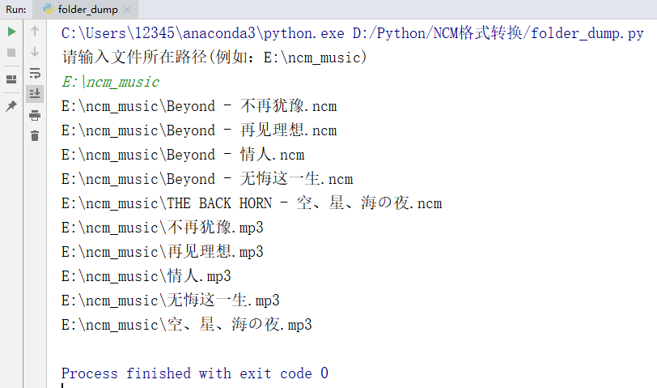


## 转换工具

### ncmdump

- 下载地址  
  链接：https://pan.baidu.com/s/1ggM8RBKiKYpwdxuemE0H8w  
  提取码：cyx6
- 使用方法  
  把ncm文件拖进main.exe，就会在ncm文件所在目录下生成同名的MP3文件
- 优点  
  支持批量操作，生成的MP3文件与ncm文件保存在同一目录，且与该文件同名
- 缺点  
  操作不够方便，无法自由选择保存路径

### ncmdump-gui

- 下载地址  
  链接：[百度网盘 请输入提取码](https://pan.baidu.com/s/1NMVQo4bYlJtPPHA1LQPCIQ)  
  提取码：cyx6
- 使用方法  
  直接打开DesktopTool.exe  
 
  将待转换的ncm文件拖入框中  

- 优点  
  具有可视化的图形窗口
- 缺点  
  生成的mp3文件会保存在可执行文件所在的文件夹中，无法自由选择保存路径

### ncm-mp3

- 下载地址  
  链接：https://pan.baidu.com/s/1NcB36Nafyfn5MwdyEUNjig  
  提取码：cyx6
- 使用方法  
  
- 优点  
  配合ctrl键和shift键选中多个文件，可以实现批量转换，而且新生成的MP3文件保存在原ncm文件所在路径下，相对比较合理
- 缺点  
  不够方便，需要将ncm文件拖拽到main.exe处，且无法自由选择保存路径


### NCM文件转换

- 下载地址  
  链接：[百度网盘 请输入提取码](https://pan.baidu.com/s/1mcGWY3RWLvwrs3VlqGr6gw)  
  提取码：cyx6
- 使用方法  

- 优点  
  具有可视化的图形窗口，支持批量操作，可以自定义转换后的音乐文件保存路径。  

  点击开始转换后可以选择保存目录  

- 缺点  无


**参考连接：[点这里](https://www.zybuluo.com/caipiz/note/1396788)**